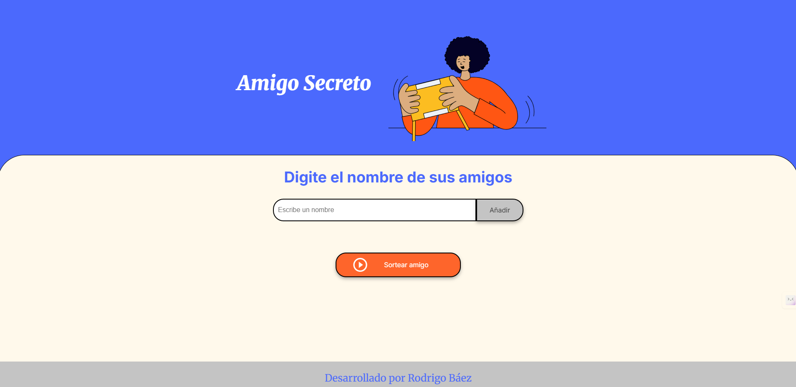
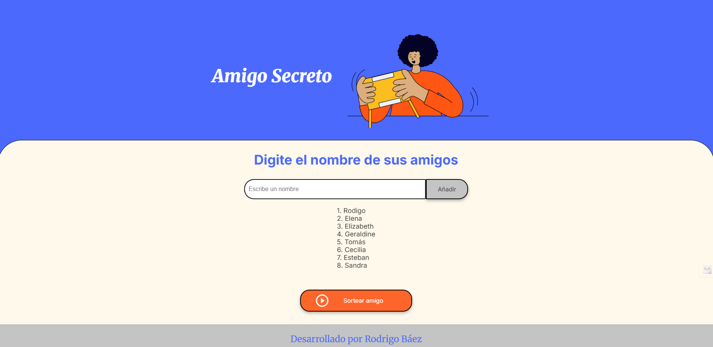
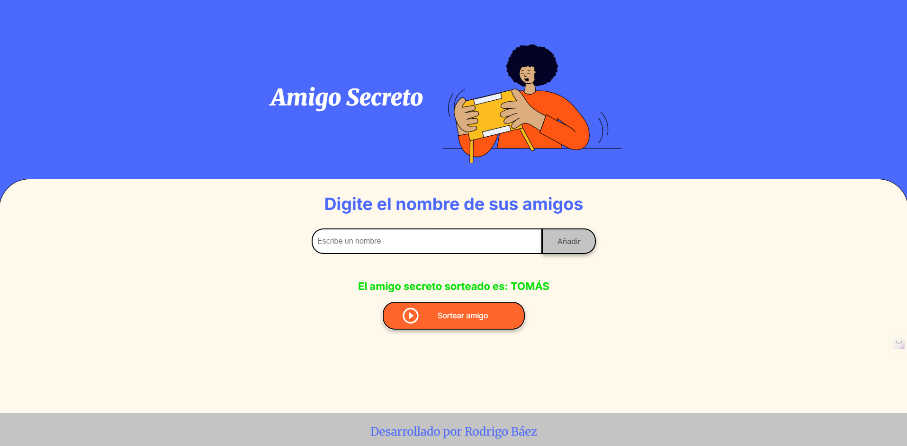

# Desafío: Lista de Amigos y Sorteo

El principal objetivo de este desafío es fortalecer tus habilidades en lógica de programación. Este proyecto permite a los usuarios gestionar una lista de amigos y realizar un sorteo de amigo secreto.

**Interfaz Principal**


## Características
- Agregar amigos a una lista, validando que no se ingresen nombres duplicados.
- Visualizar la lista de amigos actualizada en la interfaz.
- Realizar el sorteo de un amigo secreto de manera aleatoria.
- Reiniciar la lista de amigos después del sorteo.

## Cómo Usar el Proyecto
1. **Agregar amigos:**
   - Escribe un nombre en el campo de texto y presiona el botón "Agregar".
   - Si el nombre está vacío o ya existe en la lista, se mostrará una alerta.
2. **Actualizar la lista de amigos:**
   - Cada vez que agregues un amigo, la lista se actualizará automáticamente.

   **Lista de amigos**
   

3. **Sortear un amigo secreto:**
   - Presiona el botón "Sortear" para seleccionar un amigo aleatorio de la lista.
   - El nombre del amigo sorteado se mostrará en la interfaz.
   - La lista de amigos se limpiará automáticamente.

   **Amigo sorteado**
   


## Ejecución del Proyecto

1. Clona este repositorio en tu computadora:
   ```bash
   git clone https://github.com/Robacru/Desafio-amigo-secreto.git
